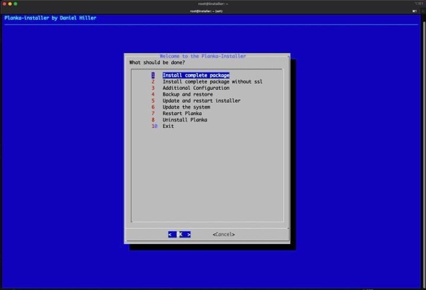

# Informations
### Demo
See the installer in action https://www.youtube.com/watch?v=0Qya8iLDnq0




## Features
- Installing all needed packages
- Installing Planka
- NGINX reverse proxy
- Automated certificates
- Automated backups
- Automated updates
- Fail2Ban and Firewall
- Generating first Admin user (Coming with the next release version of Planka)


## Roadmap
- Cleanup the code
- Consider more features


### Backups
Backup will be stored here
```bash
/opt/planka/backup
```

### Logs
You can find all logs here
```bash
/opt/planka/logs
```

### Uninstalling / Reinstalling
You can re-install Planka by using the "Uninstall Planka" Option in the installer
#### Option 1 light
+ Delete Planka Containers
+ Delete all docker volumes
+ Delete the configuration of nginx

#### Option 2 Full (Coming soon)
+ all of option 1
+ revoke ssl certificate( SSL Setup)
+ delete acme accounts( SSL Setup)
+ remove all installed packages(docker nginx certbot( SSL Setup))
+ remove addet reposetories

*No matter which option was chosen, backups are never deleted*

## Some notes
+ No i will not support your favorite Linux distro
+ No i will not support Windows
+ No pull requests, because of typos

## License
[AGPL-3.0 license](https://github.com/plankanban/planka-installer/blob/main/LICENSE)