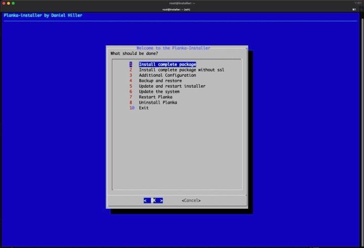

# Overview

## Demo
See the installer in action: https://www.youtube.com/watch?v=0Qya8iLDnq0



## Features

- Installs all required packages
- Installs Planka
- Configures Nginx reverse proxy
- Automates SSL certificates
- Automates backups
- Automates updates
- Configures Fail2Ban and Firewall
- Creates the first admin user

## Roadmap

- Clean up the code
- Consider additional features

## Backups
Backups will be stored here:

```bash
/opt/planka/backup
```

## Logs
Logs can be found here:

```bash
/opt/planka/logs
```

## Uninstalling / Reinstalling

You can reinstall Planka using the "Uninstall Planka" option in the installer.

### Option 1: Light
- Delete Planka containers
- Delete all Docker volumes
- Delete the Nginx configuration

### Option 2: Full (Coming Soon)
- All of Option 1
- Revoke SSL certificates (SSL Setup)
- Delete ACME accounts (SSL Setup)
- Remove all installed packages (Docker, Nginx, Certbot, etc.)
- Remove added repositories

*Note: No matter which option is chosen, backups are never deleted.*

## Some Notes

- No, I will not support your favorite Linux distribution.
- No, I will not support Windows.
- No pull requests for typo fixes.

## License

[AGPL-3.0 License](https://github.com/plankanban/planka-installer/blob/main/LICENSE)
